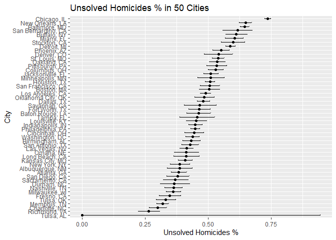
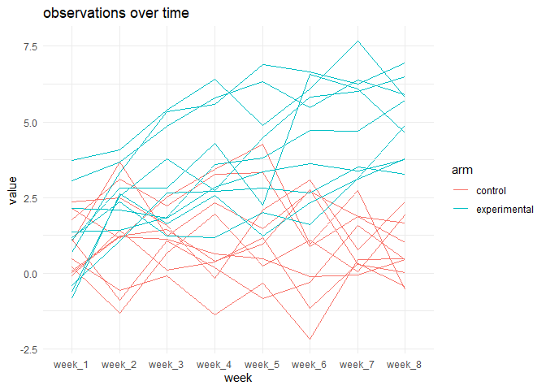
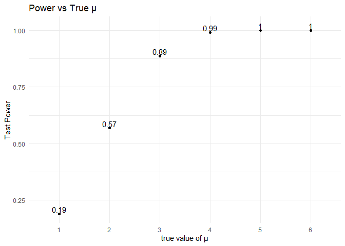
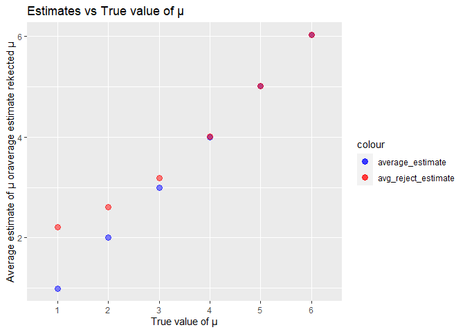

p8105_hw5_zq2227
================
Zixuan Qiu
2023-11-12

``` r
library(tidyverse)
library(broom)
library(rvest)
set.seed(1)
```

# Problem 1

**Describe the raw data:** This data set collect the more than 52,000
criminal homicides in 50 largest American cities over the past decade.
The data include the 13 variables that include the information of
victim,location of the killing, report time and whether an arrest. The
location of the case were recorded as the latitude and longitude.The New
York City only have two years data compare to other city’s data ending
in 2017.

``` r
homicides= read_csv("./data/homicide-data.csv")
```

``` r
homicides=homicides|>
  mutate(city_state =paste(city, state, sep = ", "))
```

``` r
totalnumber=homicides|>
  group_by(city_state)|>
  summarise(
    nobs=n(),
    unsolved= sum(disposition == "Closed without arrest" | disposition == "Open/No arrest") )|>
  arrange(desc(nobs))

totalnumber
```

    ## # A tibble: 51 × 3
    ##    city_state        nobs unsolved
    ##    <chr>            <int>    <int>
    ##  1 Chicago, IL       5535     4073
    ##  2 Philadelphia, PA  3037     1360
    ##  3 Houston, TX       2942     1493
    ##  4 Baltimore, MD     2827     1825
    ##  5 Detroit, MI       2519     1482
    ##  6 Los Angeles, CA   2257     1106
    ##  7 St. Louis, MO     1677      905
    ##  8 Dallas, TX        1567      754
    ##  9 Memphis, TN       1514      483
    ## 10 New Orleans, LA   1434      930
    ## # ℹ 41 more rows

### Baltimore

``` r
baltimore = homicides|>
  filter(city_state == "Baltimore, MD")
```

``` r
totalcases = nrow(baltimore)
totalcases
```

    ## [1] 2827

``` r
unsolvedcases= sum(pull(baltimore,disposition) == "Closed without arrest" | pull(baltimore,disposition)== "Open/No arrest")
unsolvedcases
```

    ## [1] 1825

``` r
proptest = prop.test(unsolvedcases, totalcases)
tidyresult = broom::tidy(proptest)

propestimated = pull(tidyresult,estimate)
propci=c(pull(tidyresult,conf.low),pull(tidyresult,conf.high))
```

``` r
propestimated
```

    ##         p 
    ## 0.6455607

``` r
propci
```

    ## [1] 0.6275625 0.6631599

### Iteration

``` r
cityproptest= totalnumber|>
  mutate(
    propresult=map2(unsolved,nobs,~prop.test(.x, .y)),
    tidypropresult=map(propresult,broom::tidy)
  )|>
  unnest(tidypropresult)|>
  select(city_state,estimate,conf.low,conf.high)|>
  arrange(desc(estimate))
```

    ## Warning: There was 1 warning in `mutate()`.
    ## ℹ In argument: `propresult = map2(unsolved, nobs, ~prop.test(.x, .y))`.
    ## Caused by warning in `prop.test()`:
    ## ! Chi-squared approximation may be incorrect

``` r
cityproptest 
```

    ## # A tibble: 51 × 4
    ##    city_state         estimate conf.low conf.high
    ##    <chr>                 <dbl>    <dbl>     <dbl>
    ##  1 Chicago, IL           0.736    0.724     0.747
    ##  2 New Orleans, LA       0.649    0.623     0.673
    ##  3 Baltimore, MD         0.646    0.628     0.663
    ##  4 San Bernardino, CA    0.618    0.558     0.675
    ##  5 Buffalo, NY           0.612    0.569     0.654
    ##  6 Miami, FL             0.605    0.569     0.640
    ##  7 Stockton, CA          0.599    0.552     0.645
    ##  8 Detroit, MI           0.588    0.569     0.608
    ##  9 Phoenix, AZ           0.551    0.518     0.584
    ## 10 Denver, CO            0.542    0.485     0.598
    ## # ℹ 41 more rows

### Plot 1

``` r
citypropplot=cityproptest|>
  ggplot(aes(x = reorder(city_state, estimate),y=estimate))+geom_errorbar(aes(ymin = conf.low, ymax = conf.high), width = 0.2)+
  geom_point()+
  coord_flip()+
  labs(title = "Unsolved Homicides % in 50 Cities",
  x = "City", y = "Unsolved Homicides %") 

citypropplot
```

<!-- -->

# Problem 2

``` r
filename=list.files(path = "./data/hw5data")
```

``` r
readfunction= function(x){
  fileread= read.csv(paste0("./data/hw5data/",x))
  fileread
}

filedata= map(filename,readfunction)  |>
 bind_rows()|>
  mutate(id=str_extract(filename, "con_\\d+|exp_\\d+"), 
         arm = ifelse(str_detect(filename, "con"), "control", "experimental")
          )|>
  relocate(arm,id)

rctresult=knitr::kable(filedata,digits = 1)
rctresult
```

| arm          | id     | week_1 | week_2 | week_3 | week_4 | week_5 | week_6 | week_7 | week_8 |
|:-------------|:-------|-------:|-------:|-------:|-------:|-------:|-------:|-------:|-------:|
| control      | con_01 |    0.2 |   -1.3 |    0.7 |    2.0 |    0.2 |    1.1 |    0.0 |    1.9 |
| control      | con_02 |    1.1 |   -0.9 |    1.1 |    0.2 |   -0.8 |   -0.3 |    1.6 |    0.4 |
| control      | con_03 |    1.8 |    3.1 |    2.2 |    3.3 |    3.3 |    0.9 |    1.9 |    1.0 |
| control      | con_04 |    1.0 |    3.7 |    1.2 |    2.3 |    1.5 |    2.7 |    1.9 |    1.7 |
| control      | con_05 |    0.5 |   -0.6 |   -0.1 |   -1.4 |   -0.3 |   -2.2 |    0.4 |    0.5 |
| control      | con_06 |    2.4 |    2.5 |    1.6 |   -0.2 |    2.1 |    3.1 |    0.8 |    2.4 |
| control      | con_07 |    0.0 |    1.2 |    1.1 |    0.6 |    0.5 |   -0.1 |   -0.1 |    0.5 |
| control      | con_08 |   -0.1 |    1.4 |    0.1 |    0.4 |    1.2 |   -1.2 |    0.3 |   -0.4 |
| control      | con_09 |    0.1 |    1.2 |    1.4 |    0.4 |    0.9 |    2.8 |    0.3 |    0.0 |
| control      | con_10 |    2.1 |    1.1 |    2.5 |    3.4 |    4.3 |    1.0 |    2.7 |   -0.5 |
| experimental | exp_01 |    3.0 |    3.7 |    4.8 |    5.8 |    6.3 |    5.5 |    6.4 |    5.9 |
| experimental | exp_02 |   -0.8 |    2.6 |    1.6 |    2.6 |    1.2 |    2.3 |    3.1 |    3.8 |
| experimental | exp_03 |    2.1 |    2.1 |    1.8 |    2.8 |    3.4 |    3.6 |    3.4 |    3.7 |
| experimental | exp_04 |   -0.6 |    2.5 |    3.8 |    2.7 |    4.5 |    5.8 |    6.0 |    6.5 |
| experimental | exp_05 |    0.7 |    3.3 |    5.3 |    5.6 |    6.9 |    6.7 |    6.2 |    7.0 |
| experimental | exp_06 |    3.7 |    4.1 |    5.4 |    6.4 |    4.9 |    6.1 |    7.7 |    5.8 |
| experimental | exp_07 |    1.2 |    2.4 |    1.2 |    1.2 |    2.0 |    1.6 |    3.1 |    4.9 |
| experimental | exp_08 |    1.4 |    1.4 |    1.8 |    3.6 |    3.8 |    4.7 |    4.7 |    5.7 |
| experimental | exp_09 |   -0.4 |    1.1 |    2.7 |    2.7 |    2.8 |    2.6 |    3.5 |    3.3 |
| experimental | exp_10 |    1.1 |    2.8 |    2.8 |    4.3 |    2.2 |    6.6 |    6.1 |    4.6 |

### Plot 2

``` r
rctplot=filedata |>
  pivot_longer(week_1:week_8,
               names_to = "week",
               values_to = "result")|>
  ggplot(aes(x=week,y=result,group=id,color=arm))+
  geom_line()+
  theme_minimal()+
  labs(title = "observations over time",
       x = "week",
       y = "value")


rctplot    
```

<!-- -->
**comment:** Based on the plot of the data. i would say that there are
significant difference between the control and experiment group after
the 8 week observation.That means the intervention might be considered
effective. The experiment group has a higher observed value compared to
the control group over time.The experiment group’s values are more
spread out than the control group’s, indicate a wider range of outcomes.

# Problem 3

``` r
n = 30
sigma = 5
n_datasets = 5000
alpha = 0.05
```

``` r
sim_t_test = function(n, mu=0, sigma=5) {
  sim_data = rnorm(n, mean=mu, sd = sigma)
  ttest = t.test(sim_data, mu = 0,alternative = 'two.sided',conf.level = 0.975)
  tidy_result = broom::tidy(ttest)
  return(tidy_result[c("estimate", "p.value")])
}


output = vector("list", 5000)

for (i in 1:5000) {
  output[[i]] = sim_t_test(30,mu=0)
}

sim_results0 = bind_rows(output)

sim_results0
```

    ## # A tibble: 5,000 × 2
    ##    estimate p.value
    ##       <dbl>   <dbl>
    ##  1    0.412  0.629 
    ##  2    0.664  0.368 
    ##  3    0.551  0.534 
    ##  4    0.567  0.487 
    ##  5   -1.65   0.0599
    ##  6    1.19   0.229 
    ##  7    0.334  0.738 
    ##  8   -1.19   0.209 
    ##  9    0.122  0.887 
    ## 10    0.684  0.472 
    ## # ℹ 4,990 more rows

### repeat for μ={1,2,3,4,5,6}

$H_0:\mu =0, \alpha=0.05$

``` r
mus = c(1, 2, 3, 4, 5, 6)
all_results = list()

for (mu_value in mus) {
  output = vector("list", 5000)
  for (i in 1:5000) {
    output[[i]] = sim_t_test(n, mu=mu_value, sigma)
  }
  sim_results = bind_rows(output)|>
  mutate(mu = mu_value)
  all_results[[as.character(mu_value)]] = sim_results
}
```

``` r
final_results = bind_rows(all_results)|>
  relocate(mu,estimate)|>
  mutate(mu=as.factor(mu))

final_results
```

    ## # A tibble: 30,000 × 3
    ##    mu    estimate p.value
    ##    <fct>    <dbl>   <dbl>
    ##  1 1        1.52   0.0865
    ##  2 1        2.11   0.0159
    ##  3 1        2.01   0.0183
    ##  4 1        0.165  0.839 
    ##  5 1        0.108  0.912 
    ##  6 1        1.56   0.0682
    ##  7 1        2.04   0.0252
    ##  8 1        2.40   0.0154
    ##  9 1        2.15   0.0154
    ## 10 1        0.500  0.634 
    ## # ℹ 29,990 more rows

### Plot 3a

``` r
powertest=final_results|>
  group_by(mu)|>
  summarise(power=mean(p.value< 0.05))#if p < 0.05,reject the null hypothesis u=0

powerplot=powertest|>
  ggplot(aes(x=mu,y = power))+
  geom_point()+
  geom_text(aes(label = round(power, 2)), nudge_y = 0.02 )+
  theme_minimal()+
  labs(title = "Power vs True μ",
       x = "true value of μ",
       y = "Test Power")

powerplot
```

<!-- -->
**Interpretation:** According to the plot, we could conclude that the
power of test exponential increase with the true μ value increase. When
μ=1, the power of test in small,the probability of reject the null
hypothesis(u=0) is low. When the μ increase to 3 or higher the power of
test sharp rise to close to 1. It mean that the probability of reject
the null hypothesis is close to 1. There is a positive relationship
between effect size and power of test. The larger the effect size, the
greater the power test. Since the larger effects are easier to detect by
statistical tests, especially if the sample size is fixed.

### Plot 3b

``` r
estimate_avg = final_results |>
  group_by(mu)|>
  summarise(average_estimate = mean(estimate))


reject_avg = final_results |>
  filter(p.value < alpha)|>
  group_by(mu) |>
  summarise(avg_reject_estimate=mean(estimate))

combined_avg = left_join(estimate_avg, reject_avg, by = "mu")
```

``` r
avgplot=combined_avg|>
  ggplot()+
  geom_point(aes(x = mu, y = average_estimate ,color = "average_estimate"),size=3,alpha=0.5)+
  geom_point(aes(x = mu, y = avg_reject_estimate,color = "avg_reject_estimate"),size=3,alpha=0.5)+
  scale_color_manual(values = c("average_estimate" = "blue", "avg_reject_estimate" = "red"))+
  labs(x = "True value of μ", y = "Average estimate of μ oraverage estimate rekected μ", title = "Estimates vs True value of μ")
avgplot
```

<!-- -->

**Is the sample average of μ^ across tests for which the null is
rejected approximately equal to the true value of μ?**

The sample average of μ^across tests for which the null is rejected
approximately equal to the true values of μ when μ value is large. when
the μ value equal to 1 and 2, there are difference between the
avg_reject_estimate and true μ value. The average estimate of μ^ always
close to the true μ value. When the effect size is small(mu=1 or 2),the
power of test id low, the type 2 error will increase, means that the
false negative or the probability of fail to rejects a null hypothesis
that is actually false in the population will increase. That creat the
difference between the avg_reject_estimate and true μ value. When the
effect size is close to the value of the null hypothesis, the test may
not have enough power to correctly identify the effect.
